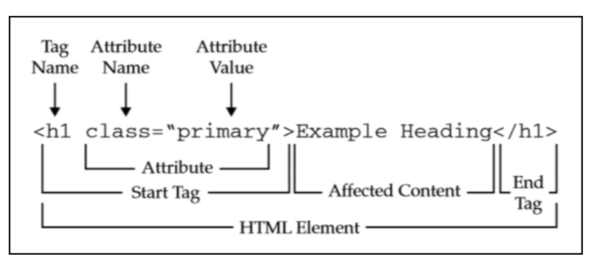
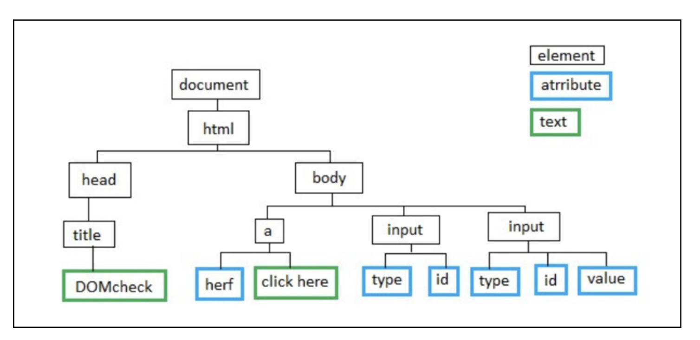
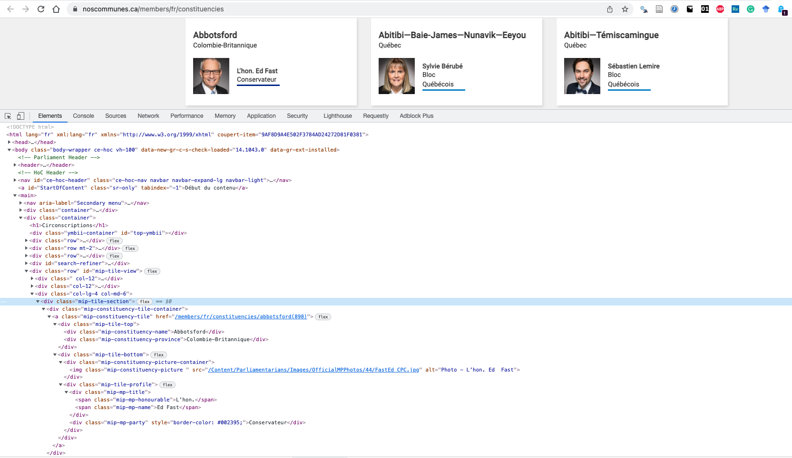

layout: true

<style>
.onehundredtwenty {
  font-size: 120%;
   }

<style>
.ninety {
  font-size: 90%;
   }

.eightyfive {
  font-size: 85%;
   }
   
.eighty {
  font-size: 80%;
   }
   
.seventyfive {
  font-size: 75%;
   }
   
.seventy {
  font-size: 70%;
   }
   
.fifty {
  font-size: 50%;
   }
   
.forty {
  font-size: 40%;
   }
</style>


```{r meta, echo=FALSE}
library(metathis)
meta() %>%
  meta_general(
    description = "Intro au WebScraping",
    generator = "xaringan and remark.js"
  ) %>%
  meta_name("github-repo" = "benjaminguinaudeau/eiom_2022_webscraping") %>%
  meta_social(
    title = "Intro au WebScraping",
    url = "https://www.benguinaudeau.com",
    og_type = "website",
    og_author = "Benjamin Guinaudeau",
    twitter_card_type = "summary_large_image",
    twitter_creator = "@Ben_Guinaudeau"
  )
```

```{r setup, include=FALSE}
workshop_day <- format(as.Date("2022-01-03"), format="%B %d %Y")
# devtools::install_github("gadenbuie/xaringanExtra")
pacman::p_load(tidyverse, fontawesome, tidyverse, knitr, xaringanExtra)

options(
    htmltools.dir.version = FALSE,
    knitr.table.format = "html",
    knitr.kable.NA = ""
)

knitr::opts_chunk$set(
    warning = FALSE,
    message = FALSE,
    cache=F,
    fig.path = "figs/",
    fig.width = 7.252,
    fig.height = 4,
    comment = "#>",
    fig.retina = 3 # Better figure resolution
)

# Enables the ability to show all slides in a tile overview by pressing "o"
xaringanExtra::use_tile_view()
xaringanExtra::use_panelset()
xaringanExtra::use_clipboard()
xaringanExtra::use_share_again()
xaringanExtra::style_share_again(share_buttons = "all")
xaringanExtra::use_extra_styles(
  hover_code_line = TRUE,
  mute_unhighlighted_code = FALSE
)

knitr::opts_chunk$set(warning = F, message = F) # Whether to display errors
```

<!-- --- -->
<!-- class: banner -->


---
name: title-slide

<div style="background-image: url('images/scraping2.jpeg'); background-size: 65%; background-position: 70% 50%; background-repeat: no-repeat;">

## `r rmarkdown::metadata$title`


###.fancy[`r rmarkdown::metadata$subtitle`]

<br>
<br>

[.seventyfive[`r fa(name = "twitter", fill = "black")` @Ben_Guinaudeau]](http://twitter.com/Ben_Guinaudeau)<br>
[.seventyfive[`r fa(name = "github", fill = "black")` @benjaminguinaudeau]](http://github.com/benjaminguinaudeau)<br>
[.seventyfive[`r fa(name = "link", fill = "black")` benguinaudeau.com/]](https://benguinaudeau.com/)

.seventyfive[4 Janvier 2022]

.fifty[Lien vers la présentation: [benguinaudeau.com/maindoc/eiom_2022_webscraping](https://benguinaudeau.com/maindoc/eiom_2022_webscraping)]

---

### Objectif: Un tremplin non technique vers le webscraping

<hr style="height:15px; visibility:hidden;" />
1. Apprendre la structure d'un projet de webscraping
--

<hr style="height:15px; visibility:hidden;" />
2. Introduire les requêtes HTTP et les langages HTML/CSS
--

<hr style="height:15px; visibility:hidden;" />
3. Présenter les packages `{xml2}` et `{rvest}`

---

### Programme de l'atelier

1. .fancy[Webscraping] .seventyfive[comme dans "grattage du web"?]
--

2. .fancy[Naviguer] .seventyfive[Localiser les données brutes]
--

3. .fancy[Aspirer] .seventyfive[Lire une page HTML]
--

4. .fancy[Extraire] .seventyfive[Raffiner les données brutes]
--

5. .fancy[Nettoyer]
--

6. .seventyfive[9 conseils pour devenir une "gratteuse" professionnelle]

---

### .fancy[Webscraping]

<center>

</center>

---

### .fancy[Webscraping]

<center>
<div class="tenor-gif-embed" data-postid="10982646" data-share-method="host" data-aspect-ratio="1.38122" data-width="70%">
<a href="https://tenor.com/view/shiba-inu-computer-fast-typing-gif-10982646">Shiba Inu GIF</a> from <a href="https://tenor.com/search/shiba-gifs">Shiba GIFs</a>
</div> 
<script type="text/javascript" async src="https://tenor.com/embed.js"></script>
</center>

---


### .fancy[Webscraping]

> Aspiration/extraction automatique de données web
--

.cols3[
  <hr style="height:15px; visibility:hidden;" />
  <center>
  Données non-structurées, lisibles par l'humain et publiquement accessibles
  
  <hr style="height:15px; visibility:hidden;" />
  </center>
  
]
.cols3[
  <br>
  <center>
  .large[**`->`**]
  </center>
]
.cols3[
  <hr style="height:10px; visibility:hidden;" />
  <center>
  Jeux de données sytématiques, structurés, rectangulaires et lisibles par la machine
  
  <hr style="height:15px; visibility:hidden;" />
  </center>
]
---

### .fancy[Webscraping] .seventyfive[A quoi bon?]

<center>

</center>

---

### La révolution digitale est une opportunité unique pour les chercheurs.euses

.seventyfive[
1 Accès exhaustif à d'immense corpus de documents
  + médias, accords internationaux, discours et procédures parlementaires, rapports annuels d'entreprises, jurisprudences, etc.
]

--

<!-- Les réseaux sociaux transforment chaque utilisateur en producteur de contenu -->
.seventyfive[
2 La trace digitale des réseaux sociaux permet l'étude de nombreux phénomènes sociaux
  + polarisation affective/idéologique (Facebook), transmission de l'information parmi les acteurs d'un marché (Twitter), parcours professionels (Linkedin), ...
]

---

### Les sites web sont optimisés pour une navigation humaine

> A quel âge Justin Trudeau est-il devenu premier ministre? 

--

Etapes: 
  A. naviguer vers un moteur de recherche
  <hr style="height:15px; visibility:hidden;" />
--

  B. chercher `"Justin Trudeau dates importantes"`
  <hr style="height:15px; visibility:hidden;" />
--

  C. sélectionner parmi les résultats un site contenant l'information
  <hr style="height:15px; visibility:hidden;" />
--

  D. extraire rapidement l'information cherchée en exploitant le formatage
  
---

### Mais l'extraction systématique de données peut rapidement devenir laborieux

> A quel âge les premiers ministres du Canada sont-ils devenus premier ministre?

Répéter A-D pour chacun des 23 premiers ministres
--

  + 1 Justin Trudeau: A, B, C,D
--

  + 2 Stephen Harper: A, B, C, D
--

  + 3 Paul Martin: A, B, C, D
--

  + ...
  + 23 John Macdonald: A, B, C, D

---

<center>
<h3> Aspiration automatique de données web </h3>
</center>

.leftcol[
#### Avantages
  + efficace (même pour des ensembles de mégadonnées)
  + systématique (données disponibles pour la population ; pas besoin d'échantillonage)
  + précis
  + (reproducible)
]

--

.rightcol[
#### Inconvénients
  + détournement de l'objectif initial des sites internet (processus technique)
  + potentielle violation des CGU
]

---

### Comment approcher un projet d'aspiration automatique? 

> *There is no one solution to all problems. It’s the problem itself that can lead to the solution.* <br> .seventyfice[~Jay Maisel]

--

Chaque projet est unique, mais tous reposent sur les mêmes compétences:
  * ingénierie URL
  * connaissances minimales des requêtes HTTP et du langage HTML
  * manipulation des sélecteurs CSS

---
class: center

<br>

### Une approche unifiée pour les projets d'aspiration automatique

<br>
--

1 .fancy[Naviguer] .seventyfive[Localiser les données brutes]
--


2 .fancy[Aspirer] .seventyfive[Accéder à l'information brute]
--


3 .fancy[Extraire] .seventyfive[Raffiner les données brutes]
--


4 .fancy[Nettoyer]

---

<center>

<h3> 1 .fancy[Naviguer] .seventyfive[Localiser les données brutes] </h3> 

<br>


</center>

---

### .fancy[Naviguer] .seventyfive[Localiser les données brutes]

<br>
+ Quelles données doivent être prélevées? 
--

+ Quelles pages devront être visitées afin de collecter les données?
--

+ Est-ce que la collecte devra être répétée chaque jour, chaque semaine, chaque année?

---

### .fancy[Exemple 1] Dates des élections fédérales canadiennes et allemandes

--

<center>
<a href = "https://www.elections.ca/content.aspx?section=ele&dir=pas&document=index&lang=f"> Site officiel d'Elections Canada</a>

</center>

---

### .fancy[Exemple 1] Dates des élections fédérales canadiennes et allemandes

<center>
<a href = "https://www.bundestag.de/parlament/wahlen/ergebnisse_seit1949-244692"> Site officiel des élections allemandes</a>

</center>

---

### .fancy[Exemple 1] Dates des élections fédérales canadiennes et allemandes

<center>
<a href = "https://en.wikipedia.org/wiki/List_of_Canadian_federal_general_elections"> Liste des élections canadiennes sur Wikipédia</a>

</center>

---

### .fancy[Exemple 1] Dates des élections fédérales canadiennes et allemandes

<center>
<a href = "https://de.wikipedia.org/wiki/Bundestagswahl"> Liste des élections allemandes sur Wikipédia</a>

</center>

---

<center>

<h3> 2 .fancy[Aspirer] .seventyfive[Charger la donnée brute] </h3> 

<br>


</center>

---

### .fancy[Aspirer] Comprendre la structure d'une URL

<center>

</center>

---

### .fancy[Aspirer] Comprendre la structure d'une URL

> https://en.wikipedia.org:80/wiki/List_of_Canadian_federal_general_elections

--

Au moins quatre éléments composent une URL

1. un protocole `https://` 
--

2. un nom de domaine `en.wikipedia.org`
--

3. un port `:80`
--

4. un chemin vers le contenu spécifique `/wiki/List_of_Canadian_federal_general_elections`
  
---

<!-- google.com == http://google.com:80/index.html -->

### .fancy[Aspirer] avec  et le package `{xml2}`

#### Input

.details[
```{r}
url <- "https://en.wikipedia.org/wiki/List_of_Canadian_federal_general_elections"
page <- xml2::read_html(url)
page
```
]

--
<br>

#### Output

```{r}
xml2::write_html(page, file = "test.html")
# file.show("test.html")
# browseURL("test.html")
```

---

<center>
<h3> .fancy[3 Extraire] .seventyfive[Raffiner les données avec `{rvest}`] </h3> 


</center>

---

#### .fancy[Exemple 2] .seventyfive[Extraire les noms, partis et liens des députés canadiens]

<center> 
<a href = "https://www.noscommunes.ca/members/fr/constituencies">Exemple 2 </a>

</center>

---

### .fancy[Extraire] .seventyfive[Qu'est-ce qu'une page web?]

<center>

</center>

---

### .fancy[Extraire] .seventyfive[Qu'est-ce qu'une page web?]

Une page web a trois composantes principales: 
--


1. **HTML (Hyper Text Markup Language)** <br> prend en charge le contenu (textes, images, liens internes/externes)
<hr style="height:15px; visibility:hidden;" />
--

2. **CSS (Cascading Style Sheets)**  <br> définit l'apparence des éléments HTML
<hr style="height:15px; visibility:hidden;" />
--

3. **JS (Javascript)**  <br> modifie l'apparence/le contenu en fonction des interactions avec l'utilisateur

---

#### .fancy[Extraire] .seventyfive[Disséquer une page web avec les outils *developer*]

<center> 

<a href = "https://www.noscommunes.ca/members/fr/constituencies"> Example 2 </a>


</center>

---

### .fancy[Extraire] .seventyfive[Une mosaïque d'éléments HTML]

<center> 

</center>

--

Chaque élément HTML
  * est délimité par des balises de début `<tag>` et de fin `</tag>`
--

  * est charactérisé par des attributs insérés dans la balise de début (id, class, type, style, etc.)
--

  * peut contenir un ou plusieurs éléments enfants (dont il est le parent)
  
---

### .fancy[Extraire] .seventyfive[Une mosaïque d'éléments HTML]

<center> 

</center>

--


Chaque page web peut être représentée comme une arborescence:
--

  * avec un sommet initial unique (document),
--

  * qui contient au moins deux enfants `head` et `body`
  
---

### .fancy[Extraire] .seventyfive[Une mosaïque d'éléments HTML]

<center> 

</center>

---


### .fancy[Extraire] .seventyfive[Parcourir l'arborescence HTML avec `{rvest}`]

1 Isoler l'élément contenant la donnée

```{r, eval = F}
webpage <- xml2::read_html(url)
elem <- isole_element(webpage, "id_of_the_element_of_containing_the_data")
```

--

2 Extraire l'information

```{r, eval = F}
value <- extract_data(elem)
```

--

<center> 

</center>

---

### .fancy[Extraire] .seventyfive[Parcourir l'arborescence HTML avec `{rvest}`]

#### .seventyfive[ 2 fonctions d'isolation]

  + .seventyfive[`html_element(parent, sélecteur)` isole le premier élément enfant de l'élément `parent` correspondant à `sélecteur`]
--

  + .seventyfive[`html_elements(parent, sélecteur)` isole l'ensemble des éléments enfant de l'élément `parent` correspondant à `sélecteur`]
  
--

#### .seventyfive[2 fonctions d'extraction]

  + .seventyfive[`html_text(element)` extrait le texte de `element`]
  
--

  + .seventyfive[`html_attr(element, attr)` extrait l'attribut `attr` de `element`]


---

### .fancy[Extraire] .seventyfive[isoler avec `rvest::html_element`]

.seventyfive[`html_element(parent, sélecteur)` isole le premier élément enfant de l'élément `parent` correspondant à `sélecteur`]

.details[
```{r}
page <- xml2::read_html("https://www.noscommunes.ca/members/fr/constituencies")
rvest::html_element(page, "body")
```
]


---

### .fancy[Extraire] .seventyfive[isoler avec `rvest::html_element`]

.seventyfive[`html_element(parent, sélecteur)` isole le premier élément enfant de l'élément `parent` correspondant à `sélecteur`]

.details[
```{r}
rvest::html_element(page, "header")
```
]

---

### .fancy[Extraire] .seventyfive[isoler avec `rvest::html_element`]

.seventyfive[`html_element(parent, sélecteur)` isole le premier élément enfant de l'élément `parent` correspondant à `sélecteur`]

.details[
```{r}
rvest::html_element(page, "[class='mip-mp-name']")
```
]

.details[
```{r}
# Shortcut for class
rvest::html_element(page, ".mip-mp-name")
```
]


---

### .fancy[Extraire] .seventyfive[isoler avec `rvest::html_elements`]

.seventyfive[`html_elements(parent, sélecteur)` isole l'ensemble des éléments enfant de l'élément `parent` correspondant à `sélecteur`]

.details[
```{r}
rvest::html_elements(page, "[class='mip-mp-name']")
```
]

---

### .fancy[Extraire] .seventyfive[extraire le texte `rvest::html_text`]

.seventyfive[`html_text(element)` extrait le texte de `element`]

.details[
```{r}
# Isole l'ensemble des éléments dont la classe contient `mip-constituency-tile`
mp_tuiles <- rvest::html_elements(page, "[class='mip-mp-name']")
# Pour chaque élément de l'ensemble, extrait l'attribut href
rvest::html_text(mp_tuiles)
```
]
---

### .fancy[Extraire] .seventyfive[extraire des attributs avec `rvest::html_attr`]

.seventyfive[`html_attr(element, attr)` extrait l'attribut `attr` de `element`]

.details[
```{r}
# Isole l'ensemble des éléments dont la classe contient `mip-constituency-tile`
mp_tuiles <- rvest::html_elements(page, "[class='mip-constituency-tile']")
# Pour chaque élément de l'ensemble, extrait l'attribut href
rvest::html_attr(mp_tuiles, "href")
```
]


<!-- ### .fancy[Exemple 2] .seventyfive[Résolution] -->


<!-- # Chaque élément de `mp_tuiles` contient les données sur un seul député -->
<!-- mp_tuiles <- rvest::html_elements(page, "[class='mip-mp-name']") -->

<!-- # La fonction `extract_all_information_on_an_mp` permet d'extraire les données d'une seule tuile -->
<!-- # Cette fonction pourra ensuite être appliqué à chacune des tuiles contenues dans mp_tuiles -->
<!-- extract_all_information_on_an_mp <- function(mp_tuile){ -->

<!-- ### .fancy[Exemple 2] .seventyfive[Résolution] -->

<!-- extract_all_information_on_an_mp <- function(mp_tuile){ -->

<!--   # Extract name -->
<!--   name_elem <- rvest::html_element(mp_tuile, ".ce-mip-mp-name") -->
<!--   name <- rvest::html_text(name_elem) -->

<!--   # Extract Party -->
<!--   party_elem <- rvest::html_element(mp_tuile, ".ce-mip-mp-party") -->
<!--   party <- rvest::html_text(party_elem) -->

<!--   # Extract Link -->
<!--   link <- rvest::html_attr(mp_tuile, "href") -->
<!--   link <- paste0("https://www.noscommunes.ca", link) -->

<!--   out <- tibble::tibble(name, party, link) -->

<!--   return(out) -->


<!-- ### .fancy[Exemple 2] .seventyfive[Résolution avec `purrr::map_dfr`] -->

<!-- mp_tuiles <- rvest::html_elements(page, "[class='mip-mp-name']") -->
<!-- # purrr::map_dfr applique extract_all_information_on_an_mp à chaque élément de mp_tuiles -->
<!-- purrr::map_dfr(mp_tuiles, extract_all_information_on_an_mp) -->

<!-- ### .fancy[Exemple 2] .seventyfive[Résolution avec `for()`] -->

<!-- all_data <- tibble::tibble() -->
<!-- for(mp_tuile in mp_tuiles){ -->
<!--   new_tile <- extract_all_information_on_an_mp(mp_tuile) -->
<!--   all_data <- dplyr::bind_rows(all_data, new_tile) -->
<!-- all_data -->

---

<center>
<h3> .fancy[4 Nettoyer] .seventyfive[L'éternel recommencement] </h3>


</center>

---

### .fancy[Nettoyer] .seventyfive[L'éternel recommencement]

Une fois extraite, il faut encore:

+ transformer les valeurs numériques en `numeric`
--

+ transformer les dates en `Date`
--

+ ajouter de nouvelles variables (notamment `lgl`)
--

+ enlever les espaces superflus des vecteurs `chr`
--


Tout cela, à l'aide des suspects habituels:

+ [`{dplyr}`](https://dplyr.tidyverse.org/) pour manipuler les jeux de données
+ [`{stringr}`](https://stringr.tidyverse.org/) pour manipuler les vecteurs `chr`
+ [`{lubridate}`](https://lubridate.tidyverse.org/) pour manipuler les dates
+ [`{purrr}`](https://purrr.tidyverse.org/) pour manipuler/itérer sur les listes

---

### Pour résumer

Un projet d'aspiration automatique s'articule autour de quatre axes:

1. .fancy[Naviguer] .seventyfive[collecter l'ensemble des adresses à visiter]
--

2. .fancy[Aspirer] .seventyfive[charger le code HTML formant la page brute]
--

3. .fancy[Extraire] .seventyfive[raffiner les données brutes]
--

4. .fancy[Nettoyer] .seventyfive[finaliser les données selon le format souhaité]

---

<center>
<h3> 9 conseils pour devenir une "gratteuse" professionnelle </h3>
</center>

<br>
<center>

</center>

---

> 1 Utilisez SelectorGadget pour se familiariser avec les sélecteurs CSS

Pour en apprendre plus [1](https://selectorgadget.com/) ; [2](https://rvest.tidyverse.org/articles/articles/selectorgadget.html)

<center>

</center>

---

<br>

> 2 Considérez les implications techniques et légales de l'aspiration automatique

Les noms de domaines incluent un fichier `robots.txt` précisant les sous-domaines pouvant être aspirés automatiquement. 

  + [{robotstxt}](https://cran.r-project.org/web/packages/robotstxt/vignettes/using_robotstxt.html)

---

<br>

> 2 Considérez les implications tecniques et légales de l'aspiration automatique

Chaque requête HTTP exerce un poid technique sur le serveur, évitez de surcharger avec des requêtes rapides et réduisez le rythme de requête.

```{r, eval = F}
for(link in links){
  aspire(link)
  # Ajouter une second de pause entre chaque aspiration
  Sys.sleep(1)
}
```

---

> 3 Aspirez directement les tableaux avec `rvest::html_table`

Les tableaux HTML (y compris ceux de Wikipédia) peuvent être aspirés directement.

.panelset[
.panel[.panel-name[Germany]

.details[
```{r}
"https://de.wikipedia.org/wiki/Bundestagswahl" %>%
  xml2::read_html() %>%
  rvest::html_table() %>%
  purrr::chuck(2)
```
]
]

.panel[.panel-name[Canada]
.details[
```{r}
"https://en.wikipedia.org/wiki/List_of_Canadian_federal_general_elections" %>%
  xml2::read_html() %>%
  rvest::html_table() %>%
  purrr::chuck(3)
```
]
]

]

---

<br>

> 4 Apprenez à maîtriser les expressions régulières

Les expréssions régulières (regex) sont un langage pour décrire des schémas de charactère. 

Par exemple, `\\d{2}\\s\\d{2}` correspond à deux chiffres, suivis d'un espace, suivi de deux chiffres. Si elles semblent parfois obscures et alétoires, elles permettent un nettoyage efficace et rapide de données textuelles.

Pour en apprendre plus sur les regex [1](https://r4ds.hadley.nz/regular-expressions.html) ; [2](https://regenerativetoday.com/a-complete-beginners-guide-to-regular-expressions-in-r/)

---

<br>

> 5 Peaufinez vos compétences en sélecteurs CSS

Les sélecteurs CSS sont souvent (comme ici) évoqués de façon superficielle. Ce sont, en réalité, des outils à la syntaxe très puissante.

Pour en apprendre plus [1](https://moderncss.dev/guide-to-advanced-css-selectors-part-one/) ; [2](https://www.geeksforgeeks.org/advanced-selectors-in-css/) ; [3](https://www.w3schools.com/cssref/css_selectors.asp) ; [4](https://www.smashingmagazine.com/2009/08/taming-advanced-css-selectors/) ; [5](https://www.learnhowtoprogram.com/user-interfaces/ui-development-basics/advanced-selectors)

---

<br>

> 6 Si elles existent, utilisez les API officielles

Une API (Application Programming Interface) permet la dissémination de données formatées pour les machines. 
<!-- Certaines plateformes proposent des API afin de mettre leurs données à disposition du public.  -->
<!-- Elles contrastent donc avec les sites web, qui disséminent les données dans un format lisible par les humains.  -->

+ [academictwitteR](https://github.com/cjbarrie/academictwitteR): Twitter
+ [riingo](https://business-science.github.io/riingo/): Données boursières (Tiingo)
+ [tuber](https://github.com/soodoku/tuber): Youtube
+ [WikipediR](https://github.com/Ironholds/WikipediR/): Wikipédia
+ [RedditExtractor](https://github.com/ivan-rivera/RedditExtractor): Reddit

---

> 7 Remontez le temps avec la [Wayback Machine](https://archive.org/web/)

--


---

<br>

> 8 Révélez les API cachées dans les site web grâce à la rétro-ingénierie des sites web

Beaucoup de sites web conservent leurs données dans des bases de données accessibles via une API personnalisée. Ces API "officieuses" peuvent être exploitées afin d'extraire un grand nombre de données. 

Pour en apprendre plus [1](https://medium.com/@williamyeny/finding-ratemyprofessors-private-api-with-chrome-developer-tools-bd6747dd228d) ; [2](https://qxf2.com/blog/api-testing-developer-tools/)

---

<br>

> 9 Simulez de réels navigateurs web afin de dépasser les problèmes de JS

Pour les plus acharnées souhaitant aspirer des pages impliquant des interactions complexes: 

  + [Selenium](https://github.com/ropensci/RSelenium)
  + [Puppeteer](https://pypi.org/project/pyppeteer/)
  + [Playwright](https://playwright.dev/python/docs/intro)/[Playwrightr](https://github.com/benjaminguinaudeau/playwrightr)

---

class: center, middle, inverse

### Merci pour votre attention!

<br>

### et n'oubliez pas

<center>

</center>
